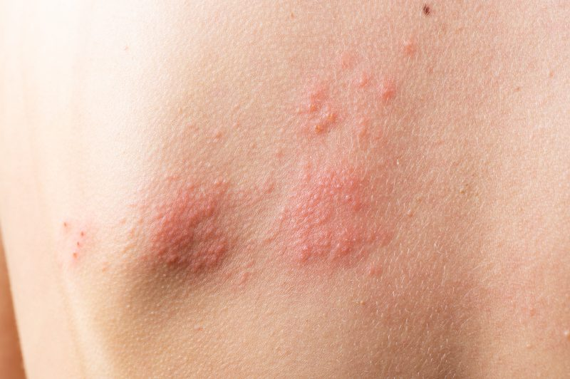

La dermatitis atópica es una enfermedad inflamatoria crónica de la piel caracterizada por una barrera epidérmica alterada.

## Fisiopatología
La dermatitis atópica es una enfermedad inflamatoria crónica de la piel caracterizada por una barrera epidérmica alterada, lo que lleva a una pérdida excesiva de agua y una mayor permeabilidad a los alérgenos. Se cree que una combinación de factores genéticos y ambientales desencadena una respuesta inmunológica anormal, resultando en inflamación y prurito.

## Signos y Síntomas
* **Prurito intenso:** A menudo precede a las lesiones cutáneas y empeora por la noche.
* **Lesiones cutáneas:** Eritema, pápulas, vesículas, exudado y costras.
* **Distribución característica:**
    * **Lactantes:** Mejillas, cuero cabelludo, tronco y extremidades extensoras.
    * **Niños y adultos:** Flexuras de codos y rodillas, muñecas, tobillos y cuello.
* **Sequedad cutánea:** Descamación y xerosis.

<figure>

<figcaption>Dermatitis atopica: extraida de: https://www.dermapeople.es/blog/dermatitis-atopica-que-es/</figcaption>
</figure>

## Clasificación
* **Según edad de inicio:**
    * **Lactante:** Antes de los 2 años.
    * **Niño:** De los 2 a los 12 años.
    * **Adulto:** Después de los 12 años.
* **Según gravedad:**
    * **Leve:** Afecta menos del 5% de la superficie corporal.
    * **Moderada:** Afecta del 5% al 10% de la superficie corporal.
    * **Severa:** Afecta más del 10% de la superficie corporal.

## Calculadoras
* **SCORAD** Índice de gravedad y extensión de la dermatitis atópica.
* **EASI:** Índice de Área y Severidad del Eczema.

[Aqui podras encontrar las calculadoras](https://pro.campus.sanofi/es/dermatitis-atopica/herramientas/calculadora-easi-scorad)

## Diagnósticos Diferenciales
* **Psoriasis:** Placas eritematosas con escamas plateadas, localización típica en codos, rodillas y cuero cabelludo.
* **Dermatitis de contacto:** Erupción pruriginosa en zonas de contacto con el alérgeno, distribución lineal o irregular.
* **Pitiriasis rubra pilaris:** Pápulas foliculares y escamas, localización en mejillas, cuero cabelludo y extremidades.

## Paraclínicos
* **Prueba del parche:** Para identificar posibles alérgenos desencadenantes.

## Tratamiento Farmacológico
* **Humectantes:** Para restaurar la barrera cutánea.

**Nota:** Como los corticoides topicos se venden en crema o tubos se recomienda calcular cuantos tubos requiere el paciente para un uso por 10 dias (aproximadamente un pulpejo, gota o indice de medicamento contiene 2 gr de este asique debe de buscar en que presentación o marga la cantidad de gramos que contenga en tubo y asi mandar la cantidad)

* **Corticosteroides tópicos:** Para reducir la inflamación y el prurito.
  * **Baja potencia**
    * [Hidrocortisona](https://www.iqb.es/cbasicas/farma/farma04/h009.htm): Aplicar 2 veces por dia.
    * Desonida
  * **Media potencia**
    * [Betametazona](https://www.iqb.es/cbasicas/farma/farma04/b019.htm): Aplicar 1 vez por dia.
  * **Alta potencia**
    * [Clobetasol](https://www.iqb.es/cbasicas/farma/farma04/c074.htm): Aplicar 1 vez por dia.

**Nota:** Para uso de corticoides se recomieda utilizar dependiendo de la zona afectada es decir para zona con piel delgada (Cara, Brazos, piernas o pliegues) usar corticoides de **baja potencia** y en casos de zonas con piel gruesa (palma de manos y pies, codo) usar corticoides de **alta potencia**. "Si el paciente es un niño recomendado usar de baja potencia".

* **Antihistamínicos orales:** Para aliviar el prurito.

## Conducta a Seguir en el Servicio de Urgencias
* **Evaluar la gravedad de las lesiones.**
* **Controlar el prurito.**
* **Iniciar tratamiento tópico con corticosteroides de potencia baja o media.**
* **Considerar antihistamínicos**
* **En caso de dermatitis persistente y que requiera el uso de corticoides de alta potencia o tratamiento inmunosupresor remitir a dermatólogía para seguimiento.**

## Ejemplo de Orden Clínica
* **Humectante:** Aplicar [nombre del humectante] sobre la piel afectada 2-3 veces al día.
* **Corticosteroide tópico:** Aplicar [nombre del corticosteroide] sobre la piel afectada [frecuencia].
* **Antihistamínico oral:** [Nombre del antihistamínico] [dosis] cada [tiempo].

## Bibliografía Usada
