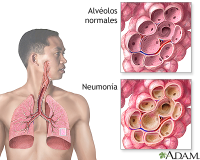

La neumonía es una infección del parénquima pulmonar que causa inflamación y acumulación de exudado en los alvéolos, dificultando el intercambio gaseoso y provocando síntomas como fiebre, tos y dificultad para respirar. Puede ser causada por bacterias, virus, hongos o parásitos.
<figure>

<figcaption></figcaption>
</figure>

## Fisiopatología
La neumonía es una infección del parénquima pulmonar que provoca inflamación y consolidación del tejido pulmonar. Los patógenos, que pueden ser bacterias, virus, hongos o parásitos, invaden los alvéolos, causando una respuesta inflamatoria. Esta respuesta incluye la acumulación de exudado inflamatorio en los alvéolos, lo que interfiere con el intercambio gaseoso y puede llevar a hipoxemia.

## Signos y Síntomas
- **Fiebre**: Generalmente alta, aunque puede ser baja en ancianos.
- **Tos**: Productiva con esputo purulento o hemoptoico.
- **Disnea**: Dificultad para respirar.
- **Dolor torácico**: Pleurítico, que empeora con la respiración profunda o la tos.
- **Taquipnea**: Aumento de la frecuencia respiratoria.
- **Taquicardia**: Aumento de la frecuencia cardíaca.
- **Fatiga y malestar general**.
- **Estertores**: Ruidos pulmonares anormales al auscultar.

## Tipos
- **Neumonía Adquirida en la Comunidad (NAC)**: Infección pulmonar que ocurre en personas que no han estado recientemente en un hospital o centro de atención médica.
- **Neumonía Nosocomial**: Infección pulmonar adquirida en un hospital, generalmente después de 48 horas de ingreso.
- **Neumonía Asociada a Ventilación Mecánica (NAVM)**: Infección pulmonar que ocurre en pacientes que han estado en ventilación mecánica por más de 48 horas.

## 4. Calculadoras
- **CURB-65**: Evalúa la gravedad de la neumonía y ayuda a decidir la necesidad de hospitalización.
  - Confusión
  - Urea > 7 mmol/L
  - Frecuencia respiratoria ≥ 30/min
  - Presión arterial sistólica < 90 mmHg o diastólica ≤ 60 mmHg
  - Edad ≥ 65 años
- **PSI (Pneumonia Severity Index)**: Clasifica la gravedad de la neumonía y predice la mortalidad.
    - Aqui podras entrar la calculadora de [PSI](https://www.samiuc.es/pneumonia-severity-index-psi/)

## 5. Diagnósticos Diferenciales
- Bronquitis aguda
- Insuficiencia cardíaca congestiva
- Embolia pulmonar
- Tuberculosis
- Neumonitis por hipersensibilidad
- Enfermedad pulmonar obstructiva crónica (EPOC) exacerbada

## Paraclínicos
- **Radiografía de tórax**: Para confirmar el diagnóstico y evaluar la extensión de la infección
- **Proteína C reactiva (PCR) y Procalcitonina**: Marcadores de inflamación e infección.
- **Hemocultivos**: Para identificar el patógeno causante.
- **Cultivo de esputo**: Para identificar bacterias específicas.
- **Antibiograma**: En caso de verficar resistencia a antibioticos.

## Tratamiento Farmacológico

Terapia empirica y reevaluar el tratamiento con lo respultados de los paraclinicos dependiendo de la bacteria y su resistencia
* **Ampicilina/Sulbactam:** 3 g IV cada 6 horas.

## Conducta a Seguir en el Servicio de Urgencias
1. **Evaluación inicial**: Historia clínica y examen físico.
2. **Estabilización**: Administrar oxígeno si hay hipoxemia, fluidos intravenosos si hay deshidratación o hipotensión.
3. **Diagnóstico**: Realizar radiografía de tórax, hemocultivos, y otros paraclínicos necesarios.
4. **Tratamiento empírico**: Iniciar antibióticos según la gravedad y el contexto clínico.
5. **Monitoreo**: Evaluar la respuesta al tratamiento y ajustar según resultados de cultivos y evolución clínica.
6. **Decisión de ingreso**: Utilizar CURB-65 o PSI para decidir si el paciente requiere hospitalización.

## Ejemplo de Orden Clínica

```
Paciente: Juan Pérez
Edad: 65 años
Diagnóstico: Neumonía Adquirida en la Comunidad

1. Oxígeno suplementario para mantener saturación ≥ 92%.
2. Iniciar tratamiento antibiótico empírico:
   - Ampicilina/Sulbactam: 3 g IV cada 6 horas.
3. Hemocultivos antes de iniciar antibióticos.
4. Radiografía de tórax PA y lateral.
5. Monitorización continua de signos vitales.
6. Revaluar en 24 horas o antes si hay cambios clínicos.
```

## Bibliografía Usada
- Mandell, L. A., et al. (2007). "Infectious Diseases Society of America/American Thoracic Society consensus guidelines on the management of community-acquired pneumonia in adults." Clinical Infectious Diseases, 44(Supplement_2), S27-S72.

- Metlay, J. P., et al. (2019). "Diagnosis and treatment of adults with community-acquired pneumonia. An official clinical practice guideline of the American Thoracic Society and Infectious Diseases Society of America." American Journal of Respiratory and Critical Care Medicine, 200(7), e45-e67.

- Torres, A., et al. (2017). "International ERS/ESICM/ESCMID/ALAT guidelines for the management of hospital-acquired pneumonia and ventilator-associated pneumonia." European Respiratory Journal, 50(3), 1700582.
