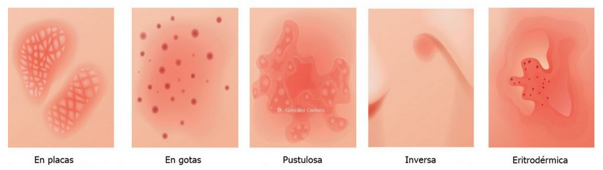

La psoriasis es una enfermedad inflamatoria crónica de la piel caracterizada por un ciclo acelerado de crecimiento de las células cutáneas. Normalmente, las células cutáneas se renuevan cada 28 días, pero en la psoriasis, este proceso se acelera a 3-4 días. Esto lleva a una acumulación de células cutáneas en la superficie de la piel, formando placas escamosas y rojas.


## Fisiopatología:

La fisiopatología de la psoriasis es compleja e involucra una interacción entre factores genéticos, inmunológicos y ambientales. Se cree que la enfermedad se desencadena por una respuesta inmunitaria anormal a un antígeno desconocido, lo que lleva a la activación de células T y la liberación de citocinas proinflamatorias. Estas citocinas promueven la proliferación y diferenciación de queratinocitos, lo que resulta en la formación de placas psoriásicas.

## Signos y Síntomas:

Los síntomas más comunes de la psoriasis incluyen:

* **Placas rojas y escamosas:** Estas placas suelen ser bien delimitadas y pueden aparecer en cualquier parte del cuerpo, pero son más comunes en el cuero cabelludo, los codos, las rodillas, la espalda baja y el tronco.
* **Piel seca y agrietada:** La piel afectada por la psoriasis puede ser seca y agrietada, lo que puede causar dolor y sangrado.
* **Picazón:** La picazón puede ser intensa y puede empeorar por la noche.
* **Dolor:** Algunas personas con psoriasis experimentan dolor en las áreas afectadas.
* **Uñas afectadas:** Las uñas pueden engrosarse, descolorarse o deshacerse.
* **Artritis psoriásica:** Una forma de artritis que afecta las articulaciones y puede causar dolor, rigidez e inflamación.

## Tipos

La psoriasis se clasifica en diferentes tipos, según su apariencia y ubicación:

<figure>

<figcaption>Tipos de psoriasis</figcaption>
</figure>

* **Psoriasis en placas:** La forma más común, caracterizada por placas rojas y escamosas.
* **Psoriasis pustulosa:** Se caracteriza por pústulas (ampollas llenas de pus) que pueden aparecer en diferentes patrones.
* **Psoriasis en gotas:** Se caracteriza por pequeñas lesiones rojas y escamosas que se asemejan a gotas.
* **Psoriasis inversa:** Se presenta en los pliegues de la piel, como las axilas, la ingle y debajo de los senos.
* **Psoriasis eritrodérmica:** Una forma grave que afecta la mayor parte de la superficie corporal.
* **Psoriasis del cuero cabelludo:** Afecta el cuero cabelludo y puede causar picazón y descamación.
* **Psoriasis ungueal:** Afecta las uñas y puede causar engrosamiento, descoloración y desprendimiento.

## Calculadoras:

Existen calculadoras online que pueden ayudar a evaluar la gravedad de la psoriasis, como el **Psoriasis Area and Severity Index (PASI)**. Estas calculadoras utilizan una escala para evaluar la extensión y la gravedad de las lesiones psoriásicas.
[Aqui podras encontrar la calculadora](http://www.ser.es/wp-content/uploads/2015/03/PASI_INDICE.pdf)

## Diagnósticos Diferenciales:

Es importante diferenciar la psoriasis de otras enfermedades de la piel que pueden tener síntomas similares, como:

* **Dermatitis atópica:** Una enfermedad inflamatoria crónica de la piel que causa picazón, sequedad y enrojecimiento.
* **Eczema:** Una condición inflamatoria de la piel que puede causar enrojecimiento, picazón y descamación.
* **Liquen plano:** Una enfermedad inflamatoria de la piel que causa lesiones rojas, brillantes y escamosas.
* **Pitiriasis rosada:** Una enfermedad cutánea benigna que causa una erupción en forma de árbol de Navidad.
* **Micosis fungoide:** Un tipo de linfoma cutáneo que puede causar lesiones rojas, escamosas y pruriginosas.

## Paraclínicos:

En algunos casos, se pueden realizar pruebas para confirmar el diagnóstico de psoriasis y descartar otras enfermedades. Estas pruebas pueden incluir:

* **Biopsia de piel:** Se toma una pequeña muestra de piel para examinarla bajo un microscopio.
* **Cultivo de hongos:** Se realiza para descartar una infección por hongos.
* **Análisis de sangre:** Se pueden realizar para evaluar la función hepática y renal, así como para descartar otras enfermedades.

## Tratamiento Farmacológico:

El tratamiento de la psoriasis depende de la gravedad de la enfermedad y de la preferencia del paciente. Las opciones de tratamiento incluyen:

* **Tópicos:** Cremas, ungüentos y lociones que se aplican directamente sobre la piel.
* **Fototerapia:** Exposición a la luz ultravioleta (UV) para reducir la inflamación y la proliferación de células cutáneas.
* **Medicamentos sistémicos:** Medicamentos que se toman por vía oral o se inyectan para controlar la inflamación y la proliferación de células cutáneas.
* **Terapia biológica:** Medicamentos que se dirigen a proteínas específicas del sistema inmunitario para reducir la inflamación.

## Ejemplo de Orden Clínica:
```
Orden Clínica:

Paciente: [Nombre del paciente]
Fecha: [Fecha]
Diagnóstico: Psoriasis en placas

Tratamiento:

* Crema de corticosteroides tópica al 1% dos veces al día.
* Fototerapia UVB dos veces por semana.
* Seguimiento en 2 semanas.
```

## Bibliografía Usada:
[Dermatología: principales diagnósticos y tratamientos. (2022). España: Elsevier Health Sciences.](https://www.google.com.co/books/edition/Dermatolog%C3%ADa_principales_diagn%C3%B3sticos/hEqGEAAAQBAJ?hl=es-419&gbpv=0)http://www.ser.es/wp-content/uploads/2015/03/PASI_INDICE.pdf