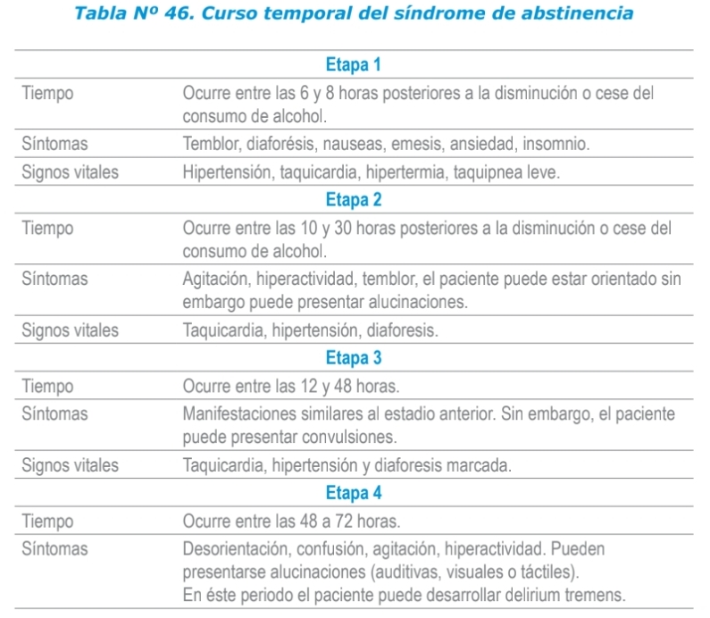

“Conjunto de manifestaciones psíquicas y físicas secundarias al cese o reducción rápida de la cantidad de alcohol ingerido en una persona que lo consume de manera intensa o prolongada.”

## Fisiopatología

La abstinencia alcohólica se asocia con la reducción en la actividad GABA y con un aumento en la actividad del glutamato. Por lo tanto, el cese abrupto de la ingesta ocasiona una hiperexcitabilidad cerebral por el aumento de la acción del glutamato sobre su receptor NMDA y por la falta de control en los receptores activos de la función inhibitoria.

## Signos y Síntomas

Cesación o reducción en el uso de alcohol en un consumidor crónico y 2 o más de los síntomas presentados en la siguiente tabla.

<figure>

<figcaption>Fig 1. Signos y síntomas por etapas</figcaption>
</figure>

## Clasificación

Se divide en:
- Leve
- Moderado
- Grave

Lo que diferencia el evento moderado del grave son las complicaciones como las <a href="https://es.wikipedia.org/wiki/Convulsi%C3%B3n" target="_blank" rel="noopener">convulsiones</a> y el <a href="https://es.wikipedia.org/wiki/Delirium_tremens" target="_blank" rel="noopener">delirium tremens</a>.

**Nota:** 

Identificarlo de esta manera es algo subjetivo, ya que se recomienda hospitalizar a todo paciente con sospecha de síndrome de abstinencia por alcohol. Esta clasificación se puede identificar con la escala CIWA-Ar; a continuación, encontrarás una calculadora para realizar la evaluación.

## Calculadoras

<a href="https://www.mdcalc.com/calc/1736/ciwa-ar-alcohol-withdrawal" target="_blank" rel="noopener">CIWA-Ar</a>

El puntaje máximo es 67. Se considera que <= 8 indica un síndrome de abstinencia leve y >= 15 indica uno grave con riesgo de delirium.

Esta medición puede repetirse cada hora y el objetivo es tener una reducción del valor a menos de 10 dentro de las primeras 24 horas.

## Diagnósticos Diferenciales

Más que diagnósticos diferenciales, se considera una progresión hacia este síndrome:

- <a href="https://rarediseases.info.nih.gov/espanol/13076/sindrome-de-wernicke-korsakoff" target="_blank" rel="noopener">Síndrome de Wernicke-Korsakoff</a>

## Paraclínicos

No hay pruebas diagnósticas específicas para el síndrome de abstinencia, solo se solicitan en búsqueda de complicaciones asociadas a la abstinencia (hemograma, perfil hepático, todo depende de la sintomatología del paciente).

## Tratamiento Farmacológico

Las <a href="https://es.wikipedia.org/wiki/Benzodiazepina" target="_blank" rel="noopener">benzodiazepinas</a> son el tratamiento estándar para este síndrome. En la literatura está más estudiado el uso de diazepam (poca tolerancia hepática) y lorazepam (mejor tolerancia hepática); por eso todo depende de tu sitio de práctica o en el lugar donde te encuentres.

- [Diazepam:](https://www.iqb.es/cbasicas/farma/farma04/d018.html) Se recomienda una dosis inicial de 10 mg IV cada 15 minutos hasta la sedación, seguida de 5-10 mg IV cada 3-4 horas según sea necesario. Se pueden administrar dosis de 5-10 mg IV cada hora si fuese necesario. Algunos pacientes pueden requerir dosis masivas de benzodiazepinas durante la fase aguda de la abstinencia alcohólica. Se han notificado dosis intravenosas de 270 mg durante 45 minutos.

- [Lorazepam:](https://www.iqb.es/cbasicas/farma/farma04/d018.html) Inicialmente 1-2 mg VO cada 8 horas. Ajustar la dosis según la respuesta clínica deseada. La dosis única máxima es de 4 mg. Disminuir la dosis después de 1-2 días de tratamiento clínicamente indicados y tolerados. Se recomienda usar cuando el paciente esté estable.

- [Tiamina:](https://www.iqb.es/cbasicas/farma/farma04/t024.htm) Inicialmente 100 mg intravenosos, seguidos de 50-100 mg IV o IM hasta que se restablezca la ingestión normal de tiamina.

**Nota:** La tiamina se debe administrar antes que la glucosa.

## Conducta a Seguir en el Servicio de urgencias

1. Hospitalizar. En la mayoría de los casos es suficiente colocar al paciente en un entorno tranquilo, con luz tenue.
2. Monitoreo de signos vitales, en especial: presión arterial y frecuencia respiratoria.
3. Iniciar tratamiento farmacológico de manera inmediata. **Si el paciente ingresa convulsionando, administrar terapia por vía IV hasta controlar la crisis y luego escalar a VO**.

## Ejemplo de Orden Clínica

- Administrar (medicamento) + (dosis) por (VO o IV) cada 15 minutos hasta la sedación.

## Bibliografía Usada

- [Toxicología Clínica CIB ed.1 2010](https://cib.org.co/servicios/catalogo/toxicologia-clinica/)
- [Guía para el Manejo de Emergencias Toxicológicas 2017](https://retoxlac.org/guia-para-el-manejo-de-emergencias-toxicologicas-bogota-2017/)